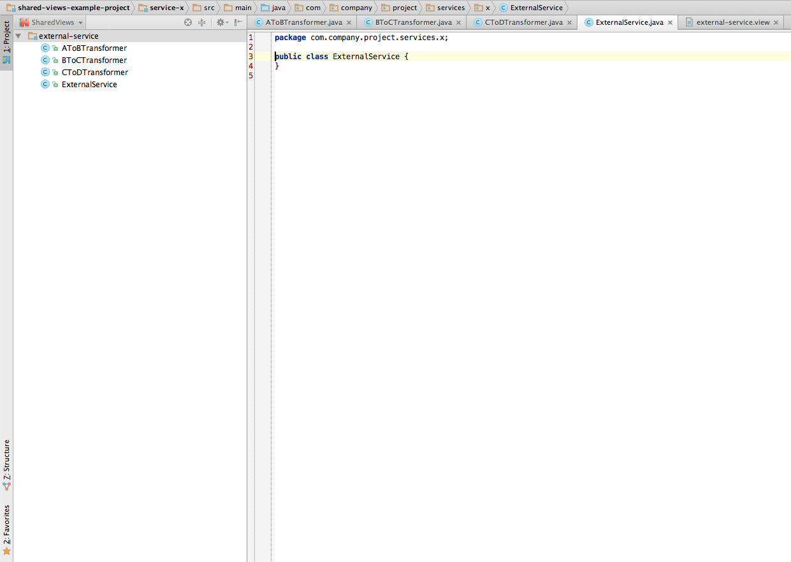

# Shared Views

### Description
---------------

Shared Views is an IntelliJ IDEA plugin that provides an alternative view of the project code defined by "views". These "view" definitions may be committed as part
of the code base and shared amongst a team. 
 
### How to build and install
----------------------------

1. Configure the IntelliJ SDK as described here [Configuring IntelliJ Platform Plugin SDK](https://www.jetbrains.com/idea/help/configuring-intellij-platform-plugin-sdk.html) - java 1.6 is necessary to set as the underlying JDK
2. Using git, clone the source code from this repository to a local folder <b>sharedviews</b>.
3. In IntelliJ, File -> New Project -> IntelliJ Platform Plugin -> Select <b>sharedviews</b>/shared-views -> Finish
4. Set the tests folder as the test root, Right click on the tests folder -> Mark Directory As -> Test Sources Root
5. Run the tests, Right click on the tests folder -> Run 'All Tests'
6. Build the plugin, Build -> Make Project
7. Generate the plugin jar, Build -> Prepare Plugin Module 'shared-views' For Deployment
8. Install the plugin, IntelliJ IDEA -> Preferences -> Plugins -> Install plugin from disk... -> Select the jar generated above -> Apply -> OK -> Restart

### Example
-------------

Code bases grow organically over time and are typically structured in a way that is convenient for building and maintaining. These modules or groupings are restricted 
in that they can only group code together in one way i.e. java packages, maven modules etc.

Take the following example project using maven:

```java
package com.company.project.module.a;

public class AToBTransformer {
  public B transform(A a) {+};
}
```

```java
package com.company.project.module.b;

public class BToCTransformer {
  public C transform(B b) {+};
}
```

```java 
package com.company.project.module.c;

public class CToDTransformer {
  public D transform(C c) {+};
}
```

```java
package com.company.project.services.x;

public class ExternalService {

  public X getX(A a) {
    B b = AToBTransformer.transform(A a);
    C c = BToCTransformer.transform(B b);
    D d = CToDTransformer.transform(C c);
    return serviceObject.callExternal(d);
  }

}
```
  
In this example it would be necessary to have four separate modules/packages open to view the object transformation in it's entirety. A shared view consisting
of these files could be created to synthetically group the related classes together.

external-service.view:

    module-a/src/main/java/com/company/project/module/a/AToBTransformer.java
    module-b/src/main/java/com/company/project/module/b/BToCTransformer.java
    module-c/src/main/java/com/company/project/module/c/CToDTransformer.java
    service-x/src/main/java/com/company/project/services/x/ExternalService.java


This would allow a developer to quickly open the associated classes and view the logic flow of the transformation of A to D.

Example project without Shared Views:


Example project with example Shared Views definition:


Example project Shared Views:


### Thanks
----------

Thanks goes to:

1. Krishnakumar Govindarajan 
2. Nerses Aznauryan 
3. Paul Wheeler 
4. Adrian Woodhead 


### Suggested features
----------------------

1. Include all of the files from a folder by providing the path to the folder.

### Legal
---------

This project is available under the [Apache 2.0 License](http://www.apache.org/licenses/LICENSE-2.0.html).

Copyright 2015 Expedia Inc.